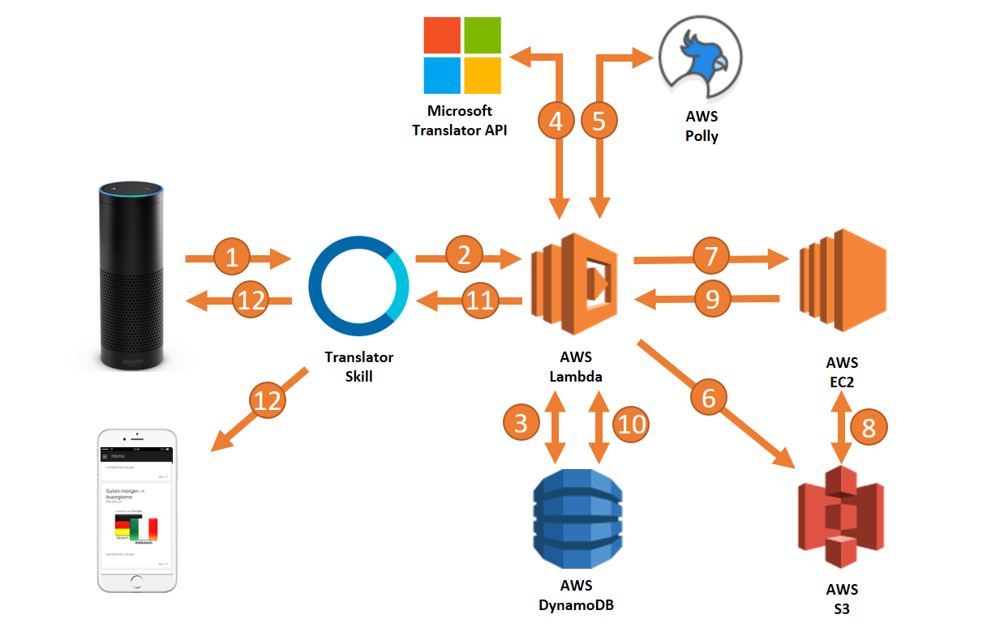

# Alexa meets AWS Polly
__Work in progress!!!__

This project demonstrates an integration of AWS Polly into an Alexa skill which translates words into different languages.
Polly is Amazon's new text-to-speech cloud service and is a perfect fit for Alexa skills aiming for playing back foreign voice.

This project combines the Alexa Skills Kit, AWS Polly and Google Translate API to translate common phrases into
17 foreign languages. The code will improve and is experimental in the current state.



1. User speaks to an Alexa device and asks for e.g. _"What does Hello mean in Polish?"_

2. The Alexa services maps the utterance to the Translate-intent and passes in a language-slot with
value _Polish_ and a term-slot having the value _Hello_. A Lambda function whose code is contained in this
Repo catches the Speechlet.

3. Firstly, the skill implementation lets the term _Hello_ translate to polish by leveraging
Google Translate API.

4. The resulting translation is then passed to AWS Polly giving it the desired VoiceId. Polly returns
an MP3 stream with the spoken translated term.

5. The translation and all information related to it is stored in a user-specific record in DynamoDB. This is how
Alexa keeps in mind what was translated recently so that she can repeat the play back on a RepeatIntent.

6. The MP3 is stored in an S3 bucket but unfortunately it is not ready yet for playback in Alexa.

7. Therefore, the MP3-Url is given to a custom service-endpoint hosted in EC2. This service
converts the MP3 into a format supported by Alexa with help of FFMPEG. Secondly, the MP3 needs more volume because
Alexa's audio stream is much louder than what you get from Polly. The conversion impacts the overall sound quality
 of the Polly voice when played back on an Alexa device - maybe it is better to go for AudioPlayer in future.

 ```bash
ffmpeg -i https://s3.amazonaws.com/path-to-source.mp3 -ac 2 -codec:a libmp3lame -b:a 48k -ar 16000 -af volume=15dB output.mp3
 ```

 This is the actual FFMPEG command that converts the file in S3. The output file is saved to local disc in order to
 immediately upload and replace it with the source file in S3.

8. The resulting MP3 overwrites its origin in S3.

9. The Url of that file - which did not change at all - is given back to the calling speechlet handler in Lambda.

10. The skill creates the output speech text and squeezes in an audio-SSML tag with the MP3-url.

11. Output speech is returned to the device. Alexa replies and plays back the translated term with one of
Polly's voices. Moreover, a card is returned to the Alexa app providing the written translation which might be very
useful to users.

